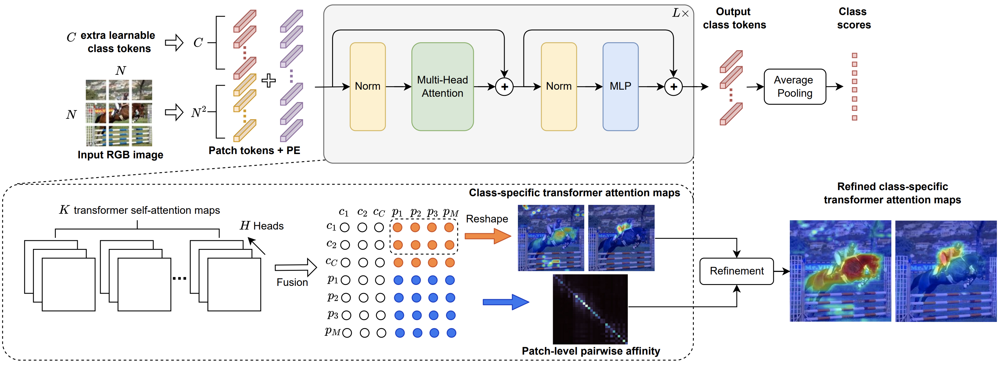

# MCTformer
The pytorch code for our CVPR2022 paper [Multi-class Token Transformer for Weakly Supervised Semantic Segmentation](https://arxiv.org/abs/2203.02891).

[[Paper]](https://arxiv.org/abs/2203.02891) [[Project Page]](https://xulianuwa.github.io/MCTformer-project-page/)

<p align="center">
  
</p>
<p align = "center">
Fig.1 - Overview of MCTformer
</p>


## Prerequisite
- Ubuntu 18.04, with Python 3.6 and the following python dependencies.
```
pip install -r requirements.txt
```
- Download [the PASCAL VOC 2012 development kit](http://host.robots.ox.ac.uk/pascal/VOC/voc2012).

## Usage
Step 1: Run the run.sh script for training MCTformer, visualizing and evaluating the generated class-specific localization maps. 
```
bash run.sh
```
### PASCAL VOC 2012 dataset

| Model        | Backbone   | Google drive |
|--------------|------------|--------------|
| MCTformer-V1 | DeiT-small | [Weights](https://drive.google.com/file/d/1jLnSbR2DDtjli5EwRYSDi3Xa6xxFIAi0/view?usp=sharing)  |
| MCTformer-V2 | DeiT-small | [Weights](https://drive.google.com/file/d/1w5LDoS_CHtDRXgFSqFtPvIiCajk4ZtMB/view?usp=sharing)  |

Step 2: Run the run_psa.sh script for using [PSA](https://github.com/jiwoon-ahn/psa) to post-process the seeds (i.e., class-specific localization maps) to generate pseudo ground-truth segmentation masks. To train PSA, the pre-trained classification [weights](https://drive.google.com/file/d/1xESB7017zlZHqxEWuh1Rb89UhjTGIKOA/view?usp=sharing) were used for initialization.
```
bash run_psa.sh
```


Step 3: For the segmentation part, run the run_seg.sh script for training and testing the segmentation model. When training on VOC, the model was initialized with the pre-trained classification [weights](https://drive.google.com/file/d/1xESB7017zlZHqxEWuh1Rb89UhjTGIKOA/view?usp=sharing) on VOC.
```
bash run_seg.sh
```

### MS COCO 2014 dataset
Run run_coco.sh for training MCTformer and generating class-specific localization maps. The class label numpy file can be download [here](https://drive.google.com/file/d/1_X0vzP4q8xth3tVSR_-uOePBQq9vQLUS/view?usp=sharing). The trained MCTformer-V2 model is [here](https://drive.google.com/file/d/1PnpQWdDvyezzN89LdTHRHE0IZqVG2USh/view?usp=sharing).
```
bash run_coco.sh
```
## Contact
If you have any questions, you can either create issues or contact me by email
[lian.xu@uwa.edu.au](lian.xu@uwa.edu.au)

## Citation
Please consider citing our paper if the code is helpful in your research and development.
```
@inproceedings{xu2022multi,
  title={Multi-class Token Transformer for Weakly Supervised Semantic Segmentation},
  author={Xu, Lian and Ouyang, Wanli and Bennamoun, Mohammed and Boussaid, Farid and Xu, Dan},
  booktitle={Proceedings of the IEEE/CVF Conference on Computer Vision and Pattern Recognition},
  pages={4310--4319},
  year={2022}
}
```


# FRD step

## Complete folder format

```text

VOC2012_org/
├─ all_data.txt
├─ cls_labels.txt
├─ train_aug_id.txt
├─ select_image.txt
├─ train_id.txt
├─ val_id.txt
└─ voc12/
   └─ VOCdevkit/
      └─ VOC2012/
         ├─ ImageSets/
         ├─ JPEGImages/
         ├─ SegmentationClass/
         ├─ SegmentationClassAug/
         └─ SlopeImages/
```

### Generate attention maps
```text
python main.py --model deit_small_MCTformerV2_patch16_224 --data-set VOC12MS --img-list train_id.txt --data-path ./dataset/VOC2012_org --output_dir ./result_dir/MCTformer_results/VOC2012_org --resume ./ckpt/FRD_VOC_checkpoint.pth --gen_attention_maps --attention-type fused --layer-index 12 --cam-npy-dir ./result_dir/MCTformer_results/VOC2012_org/attn-patchrefine-npy-ms
```
```text
--data-path The dataset path
--img-list Here train_id.txt is used to generate attention maps 
--output_dir  Output path
--resume   load the trained checkpoint
--cam-npy-dir Generated attention maps path
--gen_attention_maps  Enable CAM generation mode (no training; use --resume; outputs to --cam-npy-dir)
--attention-type      CAM type. 'fused' = class-token + patch affinity (default)
--layer-index         Transformer block index for CAM (e.g., 12 = last layer; default 12)
```

### Verify the results
```text
python evaluation.py --list train_id.txt --data-set VOC12 --data-path ./dataset/VOC2012_org --type npy --predict_dir ./result_dir/MCTformer_results/VOC2012_org/attn-patchrefine-npy-ms --curve True --start 38 --comment eval_result
```
```text
--data-path The dataset path
--predict_dir Please use the same path as the --cam-npy-dir in the previous command.
--start       Threshold start
--curve       Sweep thresholds and report the best mIoU（True/False）
--comment     A tag written to eval record/log（e.g.eval_result）
```

## After verification, please change the following --t parameter to the optimal threshold output after running the above results
Example If it is 0.59, please fill in -- 59

### Generate pseudo label 
```text
python evaluation.py --list train_id.txt --data-set VOC12 --data-path ./dataset/VOC2012_org --type npy --predict_dir ./result_dir/MCTformer_results/VOC2012_org/attn-patchrefine-npy-ms --t 59 --out-dir ./result_dir/MCTformer_results/VOC2012_org/pseudo-mask-ms-crf --out-crf 
```
```text
--predict_dir Please use the same path as the --predict_dir in the previous command.
--out-dir For the pseudo label path, please put it in the same folder, for example, put it in ./result_dir/MCTformer_results/FRD_20220311_6m/. In this folder, the pseudo-mask-ms-crf is here
```