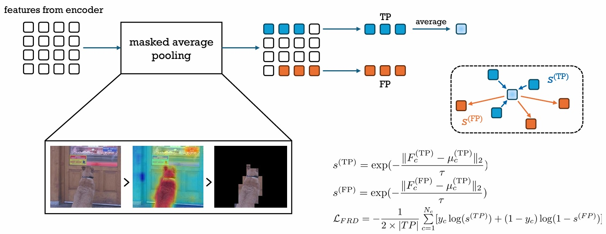
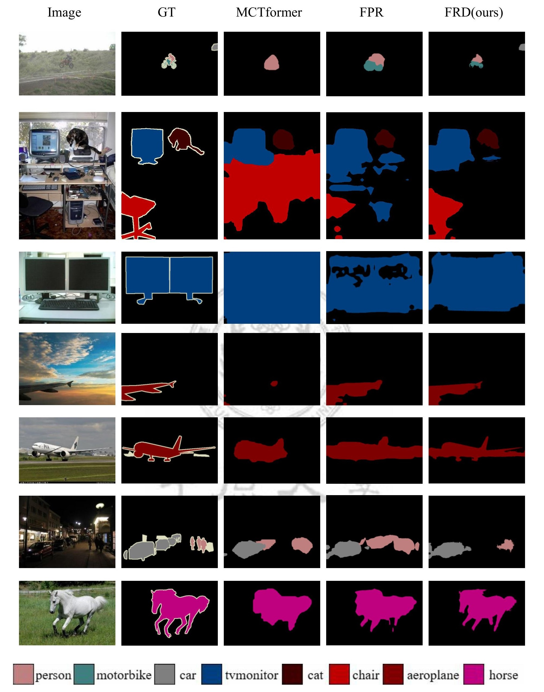
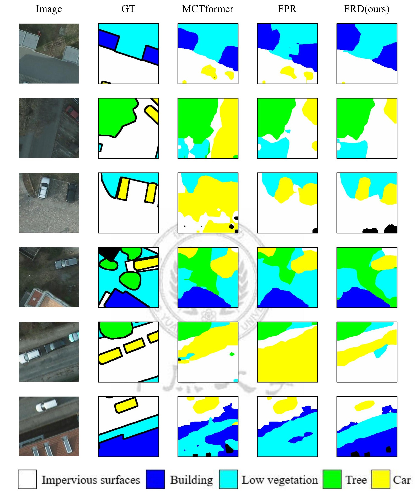
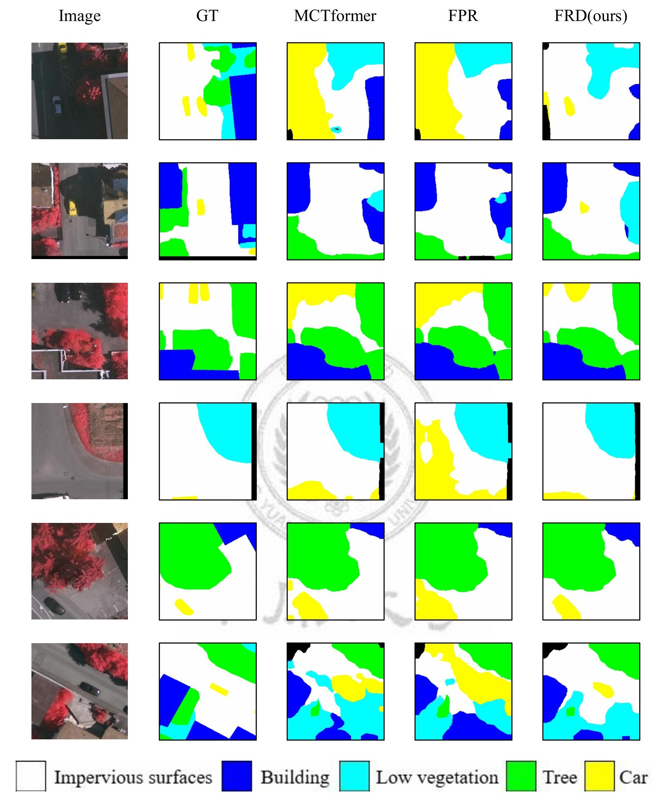

# Feature Representation Discrepancy

  

Fig.1 - Overview of FRD

---

## Environment Setup and Data Preparation 
please reference [MCTformer](https://github.com/xulianuwa/MCTformer)

---

## Pesudo Seed Result
### PASCAL VOC 2012 dataset
<table>
  <thead>
    <tr>
      <th style="text-align:center;">Model</th>
      <th style="text-align:center;">Backbone</th>
      <th style="text-align:center;">mIoU</th>
      <th style="text-align:center;">Weights</th>
    </tr>
  </thead>
  <tbody>
    <tr>
      <td style="text-align:center;">MCTformer-V2</td>
      <td style="text-align:center;">DeiT-small</td>
      <td style="text-align:center;">64.915%</td>
      <td style="text-align:center;"><a href="https://drive.google.com/file/d/1loK45CexEmkilebWFlDUp3zACH0-F6vr/view?usp=sharing">Google drive</a></td>
    </tr>
  </tbody>
</table>

  

### ISPRS Potsdam dataset

<table>
  <thead>
    <tr>
      <th style="text-align:center;">Model</th>
      <th style="text-align:center;">Backbone</th>
      <th style="text-align:center;">DSM</th>
      <th style="text-align:center;">mIoU</th>
      <th style="text-align:center;">Weights</th>
    </tr>
  </thead>
  <tbody>
    <tr>
      <td style="text-align:center;">MCTformer-V2</td>
      <td style="text-align:center;">DeiT-small</td>
      <td style="text-align:center;">❌</td>
      <td style="text-align:center;">48.554%</td>
      <td style="text-align:center;"><a href="https://drive.google.com/file/d/1G3UQsR8YGO-6alyU6eWLi_U_CNRXeOpA/view?usp=sharing">Google drive</a></td>
    </tr>
    <tr>
      <td style="text-align:center;">MCTformer-V2</td>
      <td style="text-align:center;">DeiT-small</td>
      <td style="text-align:center;">⭕</td>
      <td style="text-align:center;">51.495%</td>
      <td style="text-align:center;"><a href="https://drive.google.com/file/d/1Vh-faghSoX6vB_cTcE1WJzYggDJTCR8A/view?usp=sharing">Google drive</a></td>
    </tr>
  </tbody>
</table>

  

### ISPRS Vaihingen dataset
<table>
  <thead>
    <tr>
      <th style="text-align:center;">Model</th>
      <th style="text-align:center;">Backbone</th>
      <th style="text-align:center;">DSM</th>
      <th style="text-align:center;">mIoU</th>
      <th style="text-align:center;">Weights</th>
    </tr>
  </thead>
  <tbody>
    <tr>
      <td style="text-align:center;">MCTformer-V2</td>
      <td style="text-align:center;">DeiT-small</td>
      <td style="text-align:center;">❌</td>
      <td style="text-align:center;">32.201%</td>
      <td style="text-align:center;"><a href="https://drive.google.com/file/d/1tI8JiWTUAiobZIw5cLZTiV0Wi6MjrtfN/view?usp=sharing">Google drive</a></td>
    </tr>
    <tr>
      <td style="text-align:center;">MCTformer-V2</td>
      <td style="text-align:center;">DeiT-small</td>
      <td style="text-align:center;">⭕</td>
      <td style="text-align:center;">32.479%</td>
      <td style="text-align:center;"><a href="https://drive.google.com/file/d/17DL-DVIG_h0lnoxLld5XzaC8uyMCE-e7/view?usp=sharing">Google drive</a></td>
    </tr>
  </tbody>
</table>

  

---

## Contact
If you have any questions, you can either create issues or contact us by email
[cyculab618@gmail.com](cyculab618@gmail.com)